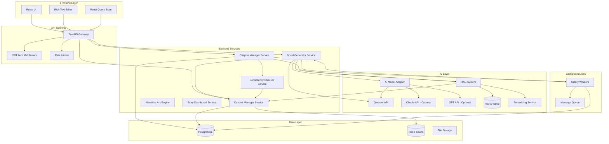
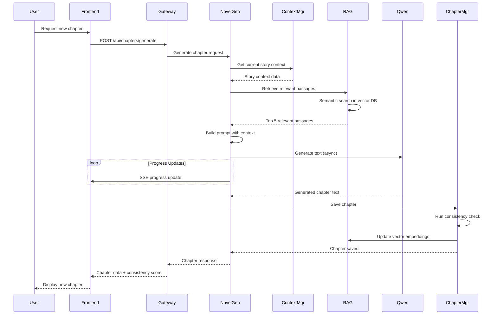

# Design Document: AI 장편소설 생성 플랫폼

## Overview

AI 장편소설 생성 플랫폼은 Qwen AI 모델을 핵심 엔진으로 활용하여 장편소설을 생성하는 전문 웹 애플리케이션입니다. 이 시스템은 기존 AI 도구들이 단편소설에만 특화되어 장편소설 생성 시 일관성이 떨어지는 문제를 해결하기 위해 설계되었습니다.

### 핵심 설계 목표

1. **장편 컨텍스트 일관성**: RAG(Retrieval-Augmented Generation) 시스템과 컨텍스트 관리를 통해 100,000+ 토큰의 긴 소설에서도 캐릭터, 플롯, 세계관의 일관성 유지
2. **한국어 최적화**: 한국어 형태소 분석, 문법 검증, 자연스러운 문체 생성을 위한 최적화
3. **사용자 제어**: 장르, 톤, 캐릭터, 플롯 구조에 대한 세밀한 제어 기능 제공
4. **확장 가능한 아키텍처**: 다중 사용자, 대용량 소설, 향후 다국어 지원을 고려한 설계
5. **신뢰성**: 자동 저장, 에러 복구, 버전 관리를 통한 작업 손실 방지
6. **내러티브 아크 추적**: 복선, 떡밥 회수, 감정 곡선을 수십 챕터에 걸쳐 추적하는 서사 흐름 엔진
7. **모델 추상화**: Qwen 외 다른 AI 모델(Claude, GPT 등)로 교체 가능한 플러그인 구조
8. **소설 전체 요약 대시보드**: 작가가 전체 서사 흐름, 캐릭터 변화, 사건 타임라인을 한눈에 파악

### 주요 기술 스택

- **Frontend**: React.js, TypeScript, TailwindCSS, React Query
- **Backend**: Python (FastAPI), Celery (비동기 작업)
- **AI Model**: Qwen API (기본) + 모델 추상화 레이어 (Claude, GPT 교체 가능)
- **Vector Database**: Pinecone 또는 Qdrant (한국어 임베딩 지원)
- **Embedding Model**: multilingual-e5-large 또는 KoSimCSE (한국어 최적화)
- **Primary Database**: PostgreSQL (소설 데이터, 메타데이터)
- **Cache**: Redis (컨텍스트 캐싱, 세션 관리)
- **Authentication**: JWT (JSON Web Tokens)
- **Narrative Engine**: 내러티브 아크 추적 및 감정 곡선 분석 엔진

## Architecture

### 시스템 아키텍처



### 레이어별 책임

#### Frontend Layer
- 사용자 인터페이스 렌더링 및 상호작용
- 실시간 텍스트 편집 및 자동 저장
- API 호출 및 상태 관리
- 에러 처리 및 사용자 피드백 표시

#### API Gateway
- RESTful API 엔드포인트 제공
- 인증 및 권한 검증
- 요청 검증 및 속도 제한
- 응답 포맷팅 및 에러 핸들링

#### Backend Services
- **Novel Generator**: Qwen 모델 호출, 프롬프트 엔지니어링, 생성 파라미터 관리
- **Context Manager**: Story_Context 저장/조회, 컨텍스트 윈도우 관리, 요약 생성
- **Chapter Manager**: 챕터 CRUD, 버전 관리, 메타데이터 관리
- **Consistency Checker**: 캐릭터/플롯/세계관 일관성 검증, 점수 계산
- **Narrative Arc Engine**: 복선/떡밥 추적, 감정 곡선 분석, 챕터 간 연결성 점수 계산
- **Story Dashboard Service**: 소설 전체 요약, 캐릭터 변화 타임라인, 사건 지도 생성

#### AI Layer
- **AI Model Adapter**: 모델 추상화 레이어 - Qwen/Claude/GPT 플러그인 교체 가능
- **Qwen API Integration**: 외부 API 호출, 재시도 로직, 에러 처리 (기본 모델)
- **RAG System**: 벡터 검색, 컨텍스트 검색, 관련 구절 추출
- **Embedding Service**: 텍스트 임베딩 생성, 배치 처리

#### Data Layer
- **PostgreSQL**: 영구 데이터 저장 (프로젝트, 챕터, 사용자, 컨텍스트)
- **Redis**: 고속 캐싱 (활성 컨텍스트, 세션, 임시 데이터)
- **Vector Store**: 임베딩 저장 및 유사도 검색

### 데이터 흐름: 챕터 생성



## Components and Interfaces

### 1. Novel Generator Service

**책임**: AI 모델을 사용한 소설 텍스트 생성

**주요 메서드**:
```python
class NovelGeneratorService:
    async def generate_chapter(
        self,
        project_id: str,
        chapter_number: int,
        parameters: GenerationParameters,
        user_prompt: Optional[str] = None
    ) -> GeneratedChapter:
        """
        새로운 챕터를 생성합니다.
        
        Args:
            project_id: 프로젝트 ID
            chapter_number: 챕터 번호
            parameters: 생성 파라미터 (장르, 톤, temperature 등)
            user_prompt: 사용자 지정 프롬프트 (선택)
            
        Returns:
            GeneratedChapter: 생성된 챕터 데이터
            
        Raises:
            QwenAPIError: Qwen API 호출 실패
            ContextError: 컨텍스트 조회 실패
        """
        pass
    
    async def regenerate_chapter(
        self,
        chapter_id: str,
        feedback: UserFeedback
    ) -> GeneratedChapter:
        """챕터를 재생성합니다 (사용자 피드백 반영)"""
        pass
    
    def _build_prompt(
        self,
        story_context: StoryContext,
        relevant_passages: List[str],
        parameters: GenerationParameters
    ) -> str:
        """Qwen 모델용 프롬프트를 구성합니다"""
        pass
```

**의존성**:
- QwenAPIClient: Qwen API 호출
- ContextManagerService: 스토리 컨텍스트 조회
- RAGSystem: 관련 구절 검색
- CeleryTask: 비동기 작업 처리

### 2. Context Manager Service

**책임**: 장편소설의 컨텍스트 관리 및 일관성 유지

**주요 메서드**:
```python
class ContextManagerService:
    async def get_story_context(
        self,
        project_id: str,
        max_tokens: int = 100000
    ) -> StoryContext:
        """
        프로젝트의 전체 스토리 컨텍스트를 조회합니다.
        
        Args:
            project_id: 프로젝트 ID
            max_tokens: 최대 토큰 수
            
        Returns:
            StoryContext: 캐릭터, 플롯, 세계관 정보
        """
        pass
    
    async def update_context(
        self,
        project_id: str,
        chapter_id: str,
        new_content: str
    ) -> None:
        """새 챕터 내용으로 컨텍스트를 업데이트합니다"""
        pass
    
    async def summarize_old_chapters(
        self,
        project_id: str,
        chapter_ids: List[str]
    ) -> str:
        """오래된 챕터를 요약하여 컨텍스트 윈도우를 관리합니다"""
        pass
    
    async def track_character_development(
        self,
        project_id: str,
        character_id: str
    ) -> CharacterTimeline:
        """캐릭터의 발전 과정을 추적합니다"""
        pass
```

**데이터 구조**:
```python
@dataclass
class StoryContext:
    project_id: str
    characters: List[Character]
    plot_points: List[PlotPoint]
    world_building: WorldBuilding
    recent_chapters_summary: str
    total_tokens: int
    last_updated: datetime
```

### 3. RAG System

**책임**: 벡터 검색을 통한 관련 컨텍스트 검색

**주요 메서드**:
```python
class RAGSystem:
    async def embed_chapter(
        self,
        chapter_id: str,
        content: str
    ) -> None:
        """
        챕터 내용을 임베딩하여 벡터 DB에 저장합니다.
        
        Args:
            chapter_id: 챕터 ID
            content: 챕터 텍스트
        """
        pass
    
    async def retrieve_relevant_passages(
        self,
        query: str,
        project_id: str,
        top_k: int = 5
    ) -> List[RelevantPassage]:
        """
        쿼리와 의미적으로 유사한 구절을 검색합니다.
        
        Args:
            query: 검색 쿼리 (현재 생성 중인 내용)
            project_id: 프로젝트 ID
            top_k: 반환할 구절 수
            
        Returns:
            List[RelevantPassage]: 유사도 점수와 함께 정렬된 구절
        """
        pass
    
    async def update_embeddings(
        self,
        chapter_id: str,
        updated_content: str
    ) -> None:
        """챕터 수정 시 임베딩을 업데이트합니다"""
        pass
```

**벡터 DB 스키마**:
```python
{
    "id": "chapter_id:paragraph_index",
    "vector": [768-dimensional embedding],
    "metadata": {
        "project_id": str,
        "chapter_id": str,
        "chapter_number": int,
        "paragraph_index": int,
        "text": str,
        "character_mentions": List[str],
        "created_at": timestamp
    }
}
```

### 4. Chapter Manager Service

**책임**: 챕터 생성, 수정, 버전 관리

**주요 메서드**:
```python
class ChapterManagerService:
    async def create_chapter(
        self,
        project_id: str,
        chapter_data: ChapterCreate
    ) -> Chapter:
        """새 챕터를 생성하고 저장합니다"""
        pass
    
    async def update_chapter(
        self,
        chapter_id: str,
        updates: ChapterUpdate
    ) -> Chapter:
        """챕터를 수정하고 버전을 저장합니다"""
        pass
    
    async def get_chapter_versions(
        self,
        chapter_id: str,
        limit: int = 5
    ) -> List[ChapterVersion]:
        """챕터의 버전 히스토리를 조회합니다"""
        pass
    
    async def reorder_chapters(
        self,
        project_id: str,
        chapter_order: List[str]
    ) -> None:
        """챕터 순서를 재정렬합니다"""
        pass
```

### 5. Consistency Checker Service

**책임**: 소설의 일관성 검증

**주요 메서드**:
```python
class ConsistencyCheckerService:
    async def check_chapter_consistency(
        self,
        chapter_id: str,
        story_context: StoryContext
    ) -> ConsistencyReport:
        """
        챕터의 일관성을 검증합니다.
        
        Returns:
            ConsistencyReport: 일관성 점수 및 발견된 문제들
        """
        pass
    
    def _check_character_consistency(
        self,
        chapter_text: str,
        characters: List[Character]
    ) -> List[ConsistencyIssue]:
        """캐릭터 이름, 속성, 관계 일관성 검증"""
        pass
    
    def _check_plot_consistency(
        self,
        chapter_text: str,
        plot_points: List[PlotPoint]
    ) -> List[ConsistencyIssue]:
        """플롯 연속성 및 논리적 모순 검증"""
        pass
    
    def _check_worldbuilding_consistency(
        self,
        chapter_text: str,
        world_building: WorldBuilding
    ) -> List[ConsistencyIssue]:
        """세계관 규칙, 위치, 타임라인 일관성 검증"""
        pass
    
    def _calculate_consistency_score(
        self,
        issues: List[ConsistencyIssue]
    ) -> int:
        """0-100 점수 계산"""
        pass
```

### 6. AI Model Adapter (신규)

**책임**: 다양한 AI 모델을 플러그인 방식으로 교체 가능하게 하는 추상화 레이어

**설계 원칙**: Strategy 패턴 적용 - 모델별 구현체를 런타임에 교체

**주요 인터페이스**:
```python
from abc import ABC, abstractmethod

class AIModelAdapter(ABC):
    """모든 AI 모델 클라이언트가 구현해야 하는 추상 인터페이스"""
    
    @abstractmethod
    async def generate_text(
        self,
        prompt: str,
        parameters: GenerationParameters
    ) -> AIModelResponse:
        """텍스트 생성 - 모든 모델 공통 인터페이스"""
        pass
    
    @abstractmethod
    async def generate_stream(
        self,
        prompt: str,
        parameters: GenerationParameters
    ) -> AsyncGenerator[str, None]:
        """스트리밍 텍스트 생성"""
        pass
    
    @property
    @abstractmethod
    def model_name(self) -> str:
        """모델 식별자"""
        pass
    
    @property
    @abstractmethod
    def max_context_tokens(self) -> int:
        """최대 컨텍스트 토큰 수"""
        pass


class QwenAdapter(AIModelAdapter):
    """Qwen 모델 구현체 (기본값)"""
    model_name = "qwen-max"
    max_context_tokens = 128000
    
    async def generate_text(self, prompt, parameters) -> AIModelResponse:
        # Qwen API 호출 구현
        pass


class ClaudeAdapter(AIModelAdapter):
    """Anthropic Claude 모델 구현체 (선택적)"""
    model_name = "claude-3-5-sonnet"
    max_context_tokens = 200000
    
    async def generate_text(self, prompt, parameters) -> AIModelResponse:
        # Claude API 호출 구현
        pass


class GPTAdapter(AIModelAdapter):
    """OpenAI GPT 모델 구현체 (선택적)"""
    model_name = "gpt-4o"
    max_context_tokens = 128000
    
    async def generate_text(self, prompt, parameters) -> AIModelResponse:
        # OpenAI API 호출 구현
        pass


class AIModelFactory:
    """설정에 따라 적절한 모델 어댑터를 반환하는 팩토리"""
    
    _adapters = {
        "qwen": QwenAdapter,
        "claude": ClaudeAdapter,
        "gpt": GPTAdapter,
    }
    
    @classmethod
    def create(cls, model_type: str, api_key: str) -> AIModelAdapter:
        adapter_class = cls._adapters.get(model_type)
        if not adapter_class:
            raise ValueError(f"지원하지 않는 모델: {model_type}")
        return adapter_class(api_key=api_key)
```

**DB 스키마 추가**:
```sql
-- 프로젝트별 AI 모델 설정
ALTER TABLE projects ADD COLUMN ai_model VARCHAR(50) DEFAULT 'qwen';
ALTER TABLE projects ADD COLUMN ai_model_config JSONB DEFAULT '{}';
```

---

### 7. Narrative Arc Engine (신규)

**책임**: 장편소설의 서사 흐름 추적 - 복선, 떡밥 회수, 감정 곡선, 챕터 간 연결성 분석

**핵심 개념**:
- **복선(Foreshadowing)**: 이후 챕터에서 회수될 암시나 단서
- **감정 곡선(Emotional Arc)**: 챕터별 긴장감/감정 강도 변화
- **연결성 점수(Narrative Cohesion Score)**: 챕터 간 서사적 연결 강도

**주요 메서드**:
```python
class NarrativeArcEngine:
    
    async def extract_foreshadowing(
        self,
        chapter_id: str,
        content: str
    ) -> List[ForeshadowingElement]:
        """
        챕터에서 복선/암시 요소를 추출합니다.
        Qwen 모델을 사용해 텍스트에서 미래 사건을 암시하는 구절 식별.
        """
        pass
    
    async def detect_payoff(
        self,
        chapter_id: str,
        content: str,
        project_id: str
    ) -> List[PayoffElement]:
        """
        이전 복선이 현재 챕터에서 회수되었는지 감지합니다.
        RAG로 이전 복선 검색 후 현재 챕터와 매칭.
        """
        pass
    
    async def calculate_emotional_arc(
        self,
        chapter_id: str,
        content: str
    ) -> EmotionalArcData:
        """
        챕터의 감정 강도와 긴장감 곡선을 계산합니다.
        단락별 감정 점수 (0-100) 반환.
        """
        pass
    
    async def calculate_narrative_cohesion(
        self,
        chapter_id: str,
        project_id: str
    ) -> float:
        """
        현재 챕터와 이전 챕터들 간의 서사적 연결성 점수를 계산합니다.
        0.0 ~ 1.0 범위, 높을수록 연결성 강함.
        """
        pass
    
    async def get_narrative_arc_summary(
        self,
        project_id: str
    ) -> NarrativeArcSummary:
        """
        프로젝트 전체의 내러티브 아크 요약을 반환합니다.
        - 미회수 복선 목록
        - 전체 감정 곡선 데이터
        - 챕터별 연결성 히트맵
        """
        pass
```

**데이터 모델**:
```python
@dataclass
class ForeshadowingElement:
    id: str
    chapter_id: str
    text_excerpt: str          # 복선이 포함된 원문 구절
    description: str           # 복선 내용 설명
    is_resolved: bool = False  # 회수 여부
    resolved_in_chapter: Optional[int] = None

@dataclass
class EmotionalArcData:
    chapter_id: str
    overall_intensity: float   # 챕터 전체 감정 강도 (0-100)
    tension_curve: List[float] # 단락별 긴장감 변화
    dominant_emotion: str      # 주요 감정 (긴장, 슬픔, 기쁨, 분노 등)

@dataclass
class NarrativeArcSummary:
    project_id: str
    unresolved_foreshadowing: List[ForeshadowingElement]
    emotional_arc_by_chapter: List[EmotionalArcData]
    cohesion_heatmap: List[List[float]]  # 챕터 간 연결성 행렬
    narrative_health_score: int          # 전체 서사 건강도 (0-100)
```

**DB 스키마 추가**:
```sql
-- 복선/떡밥 추적 테이블
CREATE TABLE foreshadowing_elements (
    id UUID PRIMARY KEY DEFAULT gen_random_uuid(),
    project_id UUID NOT NULL REFERENCES projects(id) ON DELETE CASCADE,
    chapter_id UUID NOT NULL REFERENCES chapters(id) ON DELETE CASCADE,
    text_excerpt TEXT NOT NULL,
    description TEXT NOT NULL,
    is_resolved BOOLEAN DEFAULT FALSE,
    resolved_in_chapter_id UUID REFERENCES chapters(id),
    created_at TIMESTAMP DEFAULT CURRENT_TIMESTAMP
);

-- 챕터별 감정 곡선 테이블
CREATE TABLE chapter_emotional_arcs (
    id UUID PRIMARY KEY DEFAULT gen_random_uuid(),
    chapter_id UUID NOT NULL REFERENCES chapters(id) ON DELETE CASCADE,
    overall_intensity FLOAT NOT NULL,
    tension_curve JSONB NOT NULL,  -- List[float]
    dominant_emotion VARCHAR(50),
    narrative_cohesion_score FLOAT,
    created_at TIMESTAMP DEFAULT CURRENT_TIMESTAMP
);

CREATE INDEX idx_foreshadowing_project_id ON foreshadowing_elements(project_id);
CREATE INDEX idx_foreshadowing_is_resolved ON foreshadowing_elements(is_resolved);
CREATE INDEX idx_emotional_arcs_chapter_id ON chapter_emotional_arcs(chapter_id);
```

**API 엔드포인트 추가**:
```
GET  /api/projects/{id}/narrative/arc          # 전체 내러티브 아크 요약
GET  /api/projects/{id}/narrative/foreshadowing # 복선 목록 (미회수 포함)
PUT  /api/foreshadowing/{id}/resolve            # 복선 회수 처리
GET  /api/chapters/{id}/narrative/emotional-arc # 챕터 감정 곡선
GET  /api/projects/{id}/narrative/cohesion      # 챕터 간 연결성 히트맵
```

---

### 8. Story Dashboard Service (신규)

**책임**: 소설 전체를 한눈에 파악할 수 있는 대시보드 데이터 생성

**핵심 기능**:
- 소설 전체 요약 (지금까지 어떤 사건이 있었는지)
- 캐릭터별 등장 챕터 및 변화 타임라인
- 사건 지도 (어떤 사건이 어느 챕터에서 발생했는지)
- 전체 서사 건강도 리포트

**주요 메서드**:
```python
class StoryDashboardService:
    
    async def get_full_story_summary(
        self,
        project_id: str
    ) -> StorySummary:
        """
        소설 전체의 계층적 요약을 반환합니다.
        - 전체 요약 (3~5문장)
        - 파트별 요약 (챕터 그룹)
        - 챕터별 한 줄 요약
        """
        pass
    
    async def get_character_timeline(
        self,
        project_id: str,
        character_id: Optional[str] = None
    ) -> List[CharacterTimelineEntry]:
        """
        캐릭터별 등장 챕터, 주요 행동, 감정 변화를 타임라인으로 반환합니다.
        """
        pass
    
    async def get_event_map(
        self,
        project_id: str
    ) -> EventMap:
        """
        소설 전체의 주요 사건을 챕터별로 매핑한 사건 지도를 반환합니다.
        """
        pass
    
    async def get_narrative_health_report(
        self,
        project_id: str
    ) -> NarrativeHealthReport:
        """
        소설의 서사적 건강도를 종합 분석합니다.
        - 일관성 점수
        - 미회수 복선 수
        - 감정 곡선 균형도
        - 캐릭터 등장 균형도
        - 개선 제안 목록
        """
        pass
```

**데이터 모델**:
```python
@dataclass
class StorySummary:
    project_id: str
    overall_summary: str                    # 전체 3~5문장 요약
    part_summaries: List[PartSummary]       # 파트별 요약
    chapter_one_liners: List[str]           # 챕터별 한 줄 요약
    total_chapters: int
    total_characters: int
    generated_at: datetime

@dataclass
class CharacterTimelineEntry:
    character_id: str
    character_name: str
    chapter_number: int
    appearance_type: str    # major, minor, mentioned
    key_action: str         # 해당 챕터에서의 주요 행동
    emotional_state: str    # 감정 상태
    relationship_changes: List[str]  # 관계 변화

@dataclass
class NarrativeHealthReport:
    project_id: str
    overall_health_score: int           # 0-100
    consistency_score: int
    unresolved_foreshadowing_count: int
    emotional_arc_balance: float        # 감정 곡선 균형도
    character_balance_score: float      # 캐릭터 등장 균형도
    suggestions: List[str]              # AI 기반 개선 제안
    generated_at: datetime
```

**API 엔드포인트 추가**:
```
GET  /api/projects/{id}/dashboard                    # 전체 대시보드 데이터
GET  /api/projects/{id}/dashboard/summary            # 소설 전체 요약
GET  /api/projects/{id}/dashboard/character-timeline # 캐릭터 타임라인
GET  /api/projects/{id}/dashboard/event-map          # 사건 지도
GET  /api/projects/{id}/dashboard/health-report      # 서사 건강도 리포트
```

---

### 6. Qwen API Client

**책임**: Qwen AI 모델 API 통합

**주요 메서드**:
```python
class QwenAPIClient:
    async def generate_text(
        self,
        prompt: str,
        parameters: QwenParameters
    ) -> QwenResponse:
        """
        Qwen 모델을 호출하여 텍스트를 생성합니다.
        
        Args:
            prompt: 생성 프롬프트
            parameters: temperature, top_p, max_tokens 등
            
        Returns:
            QwenResponse: 생성된 텍스트 및 메타데이터
            
        Raises:
            QwenAPIError: API 호출 실패
            QwenRateLimitError: 속도 제한 초과
        """
        pass
    
    async def _retry_with_backoff(
        self,
        request_func: Callable,
        max_retries: int = 3
    ) -> Any:
        """지수 백오프를 사용한 재시도 로직"""
        pass
```

### API 엔드포인트

#### 프로젝트 관리
```
POST   /api/projects                    # 새 프로젝트 생성
GET    /api/projects                    # 프로젝트 목록 조회
GET    /api/projects/{id}               # 프로젝트 상세 조회
PUT    /api/projects/{id}               # 프로젝트 수정
DELETE /api/projects/{id}               # 프로젝트 삭제
POST   /api/projects/{id}/export        # 프로젝트 내보내기 (PDF/EPUB/TXT)
```

#### 챕터 관리
```
POST   /api/projects/{id}/chapters/generate    # 챕터 생성
GET    /api/projects/{id}/chapters             # 챕터 목록 조회
GET    /api/chapters/{id}                      # 챕터 상세 조회
PUT    /api/chapters/{id}                      # 챕터 수정
DELETE /api/chapters/{id}                      # 챕터 삭제
POST   /api/chapters/{id}/regenerate           # 챕터 재생성
GET    /api/chapters/{id}/versions             # 챕터 버전 히스토리
POST   /api/projects/{id}/chapters/reorder     # 챕터 순서 변경
```

#### 컨텍스트 관리
```
GET    /api/projects/{id}/context              # 스토리 컨텍스트 조회
PUT    /api/projects/{id}/context              # 컨텍스트 수정
GET    /api/projects/{id}/characters           # 캐릭터 목록
POST   /api/projects/{id}/characters           # 캐릭터 생성
PUT    /api/characters/{id}                    # 캐릭터 수정
DELETE /api/characters/{id}                    # 캐릭터 삭제
GET    /api/projects/{id}/plot                 # 플롯 구조 조회
PUT    /api/projects/{id}/plot                 # 플롯 구조 수정
GET    /api/projects/{id}/worldbuilding        # 세계관 조회
PUT    /api/projects/{id}/worldbuilding        # 세계관 수정
```

#### 일관성 검증
```
GET    /api/chapters/{id}/consistency          # 챕터 일관성 검증
GET    /api/projects/{id}/consistency          # 프로젝트 전체 일관성 검증
```

#### 사용자 인증
```
POST   /api/auth/register                      # 회원가입
POST   /api/auth/login                         # 로그인
POST   /api/auth/refresh                       # 토큰 갱신
POST   /api/auth/logout                        # 로그아웃
```

## Data Models

### PostgreSQL 스키마

```sql
-- 사용자 테이블
CREATE TABLE users (
    id UUID PRIMARY KEY DEFAULT gen_random_uuid(),
    email VARCHAR(255) UNIQUE NOT NULL,
    password_hash VARCHAR(255) NOT NULL,
    username VARCHAR(100) NOT NULL,
    created_at TIMESTAMP DEFAULT CURRENT_TIMESTAMP,
    last_login TIMESTAMP,
    is_active BOOLEAN DEFAULT TRUE
);

-- 프로젝트 테이블
CREATE TABLE projects (
    id UUID PRIMARY KEY DEFAULT gen_random_uuid(),
    user_id UUID NOT NULL REFERENCES users(id) ON DELETE CASCADE,
    title VARCHAR(500) NOT NULL,
    genre VARCHAR(100),
    description TEXT,
    created_at TIMESTAMP DEFAULT CURRENT_TIMESTAMP,
    updated_at TIMESTAMP DEFAULT CURRENT_TIMESTAMP,
    total_word_count INTEGER DEFAULT 0,
    status VARCHAR(50) DEFAULT 'active',
    CONSTRAINT fk_user FOREIGN KEY (user_id) REFERENCES users(id)
);

-- 챕터 테이블
CREATE TABLE chapters (
    id UUID PRIMARY KEY DEFAULT gen_random_uuid(),
    project_id UUID NOT NULL REFERENCES projects(id) ON DELETE CASCADE,
    chapter_number INTEGER NOT NULL,
    title VARCHAR(500),
    content TEXT NOT NULL,
    word_count INTEGER NOT NULL,
    consistency_score INTEGER,
    created_at TIMESTAMP DEFAULT CURRENT_TIMESTAMP,
    updated_at TIMESTAMP DEFAULT CURRENT_TIMESTAMP,
    is_deleted BOOLEAN DEFAULT FALSE,
    CONSTRAINT fk_project FOREIGN KEY (project_id) REFERENCES projects(id),
    CONSTRAINT unique_chapter_number UNIQUE (project_id, chapter_number)
);

-- 챕터 버전 테이블
CREATE TABLE chapter_versions (
    id UUID PRIMARY KEY DEFAULT gen_random_uuid(),
    chapter_id UUID NOT NULL REFERENCES chapters(id) ON DELETE CASCADE,
    version_number INTEGER NOT NULL,
    content TEXT NOT NULL,
    word_count INTEGER NOT NULL,
    created_at TIMESTAMP DEFAULT CURRENT_TIMESTAMP,
    CONSTRAINT fk_chapter FOREIGN KEY (chapter_id) REFERENCES chapters(id),
    CONSTRAINT unique_version UNIQUE (chapter_id, version_number)
);

-- 캐릭터 테이블
CREATE TABLE characters (
    id UUID PRIMARY KEY DEFAULT gen_random_uuid(),
    project_id UUID NOT NULL REFERENCES projects(id) ON DELETE CASCADE,
    name VARCHAR(200) NOT NULL,
    age INTEGER,
    personality_traits TEXT[],
    appearance TEXT,
    background TEXT,
    relationships JSONB,
    created_at TIMESTAMP DEFAULT CURRENT_TIMESTAMP,
    updated_at TIMESTAMP DEFAULT CURRENT_TIMESTAMP,
    CONSTRAINT fk_project FOREIGN KEY (project_id) REFERENCES projects(id)
);

-- 플롯 포인트 테이블
CREATE TABLE plot_points (
    id UUID PRIMARY KEY DEFAULT gen_random_uuid(),
    project_id UUID NOT NULL REFERENCES projects(id) ON DELETE CASCADE,
    title VARCHAR(500) NOT NULL,
    description TEXT,
    plot_stage VARCHAR(100), -- exposition, rising_action, climax, falling_action, resolution
    sequence_order INTEGER NOT NULL,
    is_completed BOOLEAN DEFAULT FALSE,
    target_chapter INTEGER,
    created_at TIMESTAMP DEFAULT CURRENT_TIMESTAMP,
    CONSTRAINT fk_project FOREIGN KEY (project_id) REFERENCES projects(id)
);

-- 세계관 테이블
CREATE TABLE worldbuilding (
    id UUID PRIMARY KEY DEFAULT gen_random_uuid(),
    project_id UUID NOT NULL REFERENCES projects(id) ON DELETE CASCADE,
    category VARCHAR(100) NOT NULL, -- location, magic_system, technology, culture, etc.
    name VARCHAR(200) NOT NULL,
    description TEXT NOT NULL,
    rules JSONB,
    created_at TIMESTAMP DEFAULT CURRENT_TIMESTAMP,
    updated_at TIMESTAMP DEFAULT CURRENT_TIMESTAMP,
    CONSTRAINT fk_project FOREIGN KEY (project_id) REFERENCES projects(id)
);

-- 일관성 이슈 테이블
CREATE TABLE consistency_issues (
    id UUID PRIMARY KEY DEFAULT gen_random_uuid(),
    chapter_id UUID NOT NULL REFERENCES chapters(id) ON DELETE CASCADE,
    issue_type VARCHAR(100) NOT NULL, -- character, plot, worldbuilding
    severity VARCHAR(50) NOT NULL, -- low, medium, high
    description TEXT NOT NULL,
    line_number INTEGER,
    detected_at TIMESTAMP DEFAULT CURRENT_TIMESTAMP,
    is_resolved BOOLEAN DEFAULT FALSE,
    CONSTRAINT fk_chapter FOREIGN KEY (chapter_id) REFERENCES chapters(id)
);

-- 생성 로그 테이블 (모니터링용)
CREATE TABLE generation_logs (
    id UUID PRIMARY KEY DEFAULT gen_random_uuid(),
    chapter_id UUID REFERENCES chapters(id) ON DELETE SET NULL,
    user_id UUID NOT NULL REFERENCES users(id) ON DELETE CASCADE,
    response_time_ms INTEGER,
    token_count INTEGER,
    consistency_score INTEGER,
    parameters JSONB,
    error_message TEXT,
    created_at TIMESTAMP DEFAULT CURRENT_TIMESTAMP,
    CONSTRAINT fk_user FOREIGN KEY (user_id) REFERENCES users(id)
);

-- 인덱스 생성
CREATE INDEX idx_projects_user_id ON projects(user_id);
CREATE INDEX idx_chapters_project_id ON chapters(project_id);
CREATE INDEX idx_chapters_chapter_number ON chapters(chapter_number);
CREATE INDEX idx_characters_project_id ON characters(project_id);
CREATE INDEX idx_plot_points_project_id ON plot_points(project_id);
CREATE INDEX idx_worldbuilding_project_id ON worldbuilding(project_id);
CREATE INDEX idx_generation_logs_user_id ON generation_logs(user_id);
CREATE INDEX idx_generation_logs_created_at ON generation_logs(created_at);
```

### Python 데이터 모델

```python
from pydantic import BaseModel, Field
from typing import List, Optional, Dict
from datetime import datetime
from enum import Enum

class Genre(str, Enum):
    FANTASY = "fantasy"
    ROMANCE = "romance"
    MYSTERY = "mystery"
    SCIENCE_FICTION = "science_fiction"
    THRILLER = "thriller"

class Tone(str, Enum):
    SERIOUS = "serious"
    HUMOROUS = "humorous"
    DARK = "dark"
    LIGHTHEARTED = "lighthearted"

class PlotStage(str, Enum):
    EXPOSITION = "exposition"
    RISING_ACTION = "rising_action"
    CLIMAX = "climax"
    FALLING_ACTION = "falling_action"
    RESOLUTION = "resolution"

class GenerationParameters(BaseModel):
    genre: Genre
    tone: Tone
    temperature: float = Field(ge=0.3, le=1.2, default=0.7)
    top_p: float = Field(ge=0.0, le=1.0, default=0.9)
    max_tokens: int = Field(ge=1000, le=8000, default=3000)
    user_prompt: Optional[str] = None

class Character(BaseModel):
    id: str
    project_id: str
    name: str
    age: Optional[int] = None
    personality_traits: List[str] = []
    appearance: Optional[str] = None
    background: Optional[str] = None
    relationships: Dict[str, str] = {}
    created_at: datetime
    updated_at: datetime

class PlotPoint(BaseModel):
    id: str
    project_id: str
    title: str
    description: Optional[str] = None
    plot_stage: PlotStage
    sequence_order: int
    is_completed: bool = False
    target_chapter: Optional[int] = None
    created_at: datetime

class WorldBuilding(BaseModel):
    id: str
    project_id: str
    category: str  # location, magic_system, technology, culture
    name: str
    description: str
    rules: Dict = {}
    created_at: datetime
    updated_at: datetime

class StoryContext(BaseModel):
    project_id: str
    characters: List[Character]
    plot_points: List[PlotPoint]
    world_building: List[WorldBuilding]
    recent_chapters_summary: str
    total_tokens: int
    last_updated: datetime

class Chapter(BaseModel):
    id: str
    project_id: str
    chapter_number: int
    title: Optional[str] = None
    content: str
    word_count: int
    consistency_score: Optional[int] = None
    created_at: datetime
    updated_at: datetime

class ConsistencyIssue(BaseModel):
    issue_type: str  # character, plot, worldbuilding
    severity: str  # low, medium, high
    description: str
    line_number: Optional[int] = None

class ConsistencyReport(BaseModel):
    chapter_id: str
    overall_score: int  # 0-100
    issues: List[ConsistencyIssue]
    checked_at: datetime

class RelevantPassage(BaseModel):
    chapter_id: str
    chapter_number: int
    text: str
    similarity_score: float
    character_mentions: List[str]

class Project(BaseModel):
    id: str
    user_id: str
    title: str
    genre: Optional[Genre] = None
    description: Optional[str] = None
    created_at: datetime
    updated_at: datetime
    total_word_count: int
    status: str
```


## Correctness Properties

*A property is a characteristic or behavior that should hold true across all valid executions of a system—essentially, a formal statement about what the system should do. Properties serve as the bridge between human-readable specifications and machine-verifiable correctness guarantees.*

### Property Reflection

After analyzing all acceptance criteria, I identified the following properties suitable for property-based testing. Several redundancies were eliminated:

**Consolidated Properties:**
- Multiple "round-trip" properties (store/retrieve, embed/retrieve, export/import) were identified across different components
- Parameter validation properties were consolidated into a single comprehensive validation property
- Context update properties across different operations were unified
- Consistency checking properties for different entity types (characters, plot, worldbuilding) share the same validation pattern

**Properties Excluded:**
- UI rendering and interaction (Requirements 7.1-7.7, 13.1-13.3, 14.1, 14.4, 15.1, 15.4, 16.1, 16.5, 17.6, 18.3, 18.4, 18.6)
- External API behavior (Requirements 1.2, 12.1)
- Infrastructure configuration (Requirements 1.1, 1.3, 3.4, 11.1, 12.3, 20.1-20.5)
- Performance benchmarks (Requirements 10.1-10.6, 17.5)
- Monitoring and metrics (Requirements 19.1-19.5)

### Property 1: Parameter Validation Completeness

*For any* generation parameters (temperature, top_p, max_tokens, genre, tone), the system SHALL validate all parameters and return descriptive error messages for out-of-range or invalid values, while accepting all valid parameter combinations.

**Validates: Requirements 1.5, 13.4, 13.5**

### Property 2: Error Handling Consistency

*For any* Qwen API error response, the Backend SHALL log the error with all required fields (timestamp, error type, user context) and return a user-friendly error message in consistent JSON format.

**Validates: Requirements 1.4, 8.2, 18.5**

### Property 3: Story Context Round-Trip Preservation

*For any* StoryContext object (including characters, plot points, and worldbuilding), storing the context and then retrieving it SHALL produce an equivalent object with all data preserved.

**Validates: Requirements 2.1, 2.2, 14.2, 15.2, 16.2**

### Property 4: Context Summarization Preserves Critical Information

*For any* StoryContext exceeding the token limit, summarization SHALL reduce the token count below the limit while preserving all character names, key plot points, and worldbuilding rules.

**Validates: Requirements 2.4**

### Property 5: Character Tracking Accumulation

*For any* sequence of chapters, adding each chapter to the Context_Manager SHALL correctly accumulate character mentions, attributes, and relationships across all chapters.

**Validates: Requirements 2.5**

### Property 6: RAG Embedding Round-Trip

*For any* chapter content, embedding the content into the Vector_Store and then retrieving it by chapter_id SHALL return the original text without loss.

**Validates: Requirements 3.1**

### Property 7: RAG Retrieval Returns Correct Count and Ordering

*For any* semantic search query, the RAG_System SHALL return exactly 5 results (or fewer if less than 5 passages exist) ordered by descending similarity score.

**Validates: Requirements 3.2**

### Property 8: Retrieved Context Inclusion in Prompts

*For any* set of retrieved passages, the constructed prompt for Qwen SHALL include all retrieved passage texts.

**Validates: Requirements 3.3**

### Property 9: Embedding Update Reflects Modifications

*For any* chapter, modifying the chapter content and updating embeddings SHALL result in different embedding vectors than the original.

**Validates: Requirements 3.5**

### Property 10: Chapter Metadata Completeness

*For any* chapter creation, the stored chapter SHALL include all required metadata fields: chapter_number, creation timestamp, word_count, and content.

**Validates: Requirements 4.3**

### Property 11: Chapter Regeneration Preserves Context

*For any* project context, regenerating a chapter SHALL not modify the StoryContext (characters, plot points, worldbuilding remain unchanged).

**Validates: Requirements 4.4**

### Property 12: Chapter Operations Maintain Ordering Integrity

*For any* sequence of chapter operations (insertion, deletion, reordering), the final chapter_number sequence SHALL be continuous without gaps or duplicates.

**Validates: Requirements 4.5**

### Property 13: Version History Maintains Last N Versions

*For any* chapter with multiple updates, the version history SHALL contain at most 5 versions, with the most recent versions preserved.

**Validates: Requirements 4.6**

### Property 14: Consistency Checker Detects Known Inconsistencies

*For any* chapter containing character name mismatches, attribute contradictions, or relationship violations compared to StoryContext, the Consistency_Checker SHALL flag at least one issue for each type of inconsistency present.

**Validates: Requirements 5.1, 5.3, 5.4, 14.6, 16.4**

### Property 15: Consistency Issues Include Required Fields

*For any* detected inconsistency, the ConsistencyIssue SHALL include issue_type, severity, and description fields.

**Validates: Requirements 5.2**

### Property 16: Consistency Score Range Validity

*For any* chapter, the consistency score SHALL be an integer in the range [0, 100], with higher scores indicating fewer issues.

**Validates: Requirements 5.5**

### Property 17: Context Updates Propagate from Chapter Modifications

*For any* chapter modification, the Backend SHALL update the StoryContext to reflect changes in character mentions, plot developments, or worldbuilding elements.

**Validates: Requirements 6.2, 14.5**

### Property 18: Feedback Incorporation in Next Generation

*For any* user feedback (tone adjustment, plot direction), the next generation request SHALL include the feedback parameters in the prompt or generation parameters.

**Validates: Requirements 6.4**

### Property 19: Edit Preservation Across Regenerations

*For any* edited chapter, regenerating subsequent chapters SHALL not modify the content of the edited chapter.

**Validates: Requirements 6.5**

### Property 20: Request Validation Returns HTTP 400 for Invalid Input

*For any* API request with invalid or missing required fields, the Backend SHALL return HTTP 400 status with a JSON error response containing field-specific error messages.

**Validates: Requirements 8.5**

### Property 21: Project Creation Generates Unique Identifiers

*For any* set of created projects, all project IDs SHALL be unique (no duplicates).

**Validates: Requirements 9.1**

### Property 22: Project Metadata Round-Trip

*For any* project with metadata (title, genre, creation_date, last_modified_date), storing and retrieving the project SHALL preserve all metadata fields.

**Validates: Requirements 9.2**

### Property 23: Export Format Validity

*For any* project export to PDF, EPUB, or plain text format, the exported file SHALL be parseable by standard format validators for that format.

**Validates: Requirements 9.5, 17.1, 17.2, 17.3**

### Property 24: Cascade Deletion Completeness

*For any* project with associated chapters, characters, plot points, and worldbuilding, deleting the project SHALL remove all associated entities (no orphaned records).

**Validates: Requirements 9.6**

### Property 25: Sensitive Data Encryption

*For any* sensitive data (passwords, API keys), the stored value in the database SHALL be encrypted (not equal to the plaintext input).

**Validates: Requirements 11.2**

### Property 26: Password Hashing Determinism

*For any* password, hashing the same password multiple times with the same salt SHALL produce the same hash, and different passwords SHALL produce different hashes.

**Validates: Requirements 11.3**

### Property 27: Authorization Enforcement

*For any* user attempting to access another user's project, the Backend SHALL reject the request with HTTP 403 Forbidden.

**Validates: Requirements 11.4**

### Property 28: Transaction Rollback Maintains Data Integrity

*For any* database operation that fails mid-transaction, the database state SHALL be identical to the state before the transaction began (no partial updates).

**Validates: Requirements 11.5**

### Property 29: Rate Limiting Enforcement

*For any* user making more than 100 requests in a 60-second window, subsequent requests SHALL be rejected with HTTP 429 Too Many Requests.

**Validates: Requirements 11.6**

### Property 30: Korean Grammar Validation

*For any* Korean text with subject-object-verb order violations, the Consistency_Checker SHALL flag the grammar issue.

**Validates: Requirements 12.4**

### Property 31: Korean Text Encoding Round-Trip

*For any* Korean text string, storing the text in the database and retrieving it SHALL return the identical string without character corruption.

**Validates: Requirements 12.5**

### Property 32: Character Profile Inclusion in Generation Prompts

*For any* chapter generation with defined characters, the constructed prompt SHALL include character names, personality traits, and key attributes.

**Validates: Requirements 14.3**

### Property 33: Plot Position Inclusion in Generation Prompts

*For any* chapter generation at a specific plot stage, the constructed prompt SHALL reference the current plot stage and relevant plot points.

**Validates: Requirements 15.3**

### Property 34: Plot Point Status Updates

*For any* plot point marked as completed, retrieving the plot point SHALL show is_completed = true.

**Validates: Requirements 15.5**

### Property 35: Worldbuilding Rules Inclusion in Generation Prompts

*For any* chapter generation with defined worldbuilding rules, the constructed prompt SHALL include the relevant worldbuilding rules and constraints.

**Validates: Requirements 16.3**

### Property 36: Export Table of Contents Completeness

*For any* project export, the generated table of contents SHALL include entries for all chapters with correct chapter titles.

**Validates: Requirements 17.4**

### Property 37: Retry Logic with Exponential Backoff

*For any* Qwen API failure, the Backend SHALL retry exactly 3 times with exponentially increasing delays (e.g., 1s, 2s, 4s).

**Validates: Requirements 18.1**

### Property 38: Failed Request Preservation

*For any* generation request that fails after all retries, the Backend SHALL store the request parameters for later retry and return an error message to the user.

**Validates: Requirements 18.2**

## Error Handling

### Error Categories

The system implements comprehensive error handling across four categories:

#### 1. External API Errors (Qwen AI)

**Error Types:**
- `QwenAPIError`: General API communication failure
- `QwenAuthenticationError`: Invalid or expired API key
- `QwenRateLimitError`: API rate limit exceeded
- `QwenTimeoutError`: Request timeout (>30 seconds)
- `QwenInvalidResponseError`: Malformed response from API

**Handling Strategy:**
- Implement exponential backoff retry (3 attempts: 1s, 2s, 4s delays)
- Log all API errors with full request/response details
- Preserve failed generation requests for manual retry
- Return user-friendly error messages without exposing API details
- Fallback: Queue request for later processing when API is available

**Example:**
```python
try:
    response = await qwen_client.generate_text(prompt, parameters)
except QwenRateLimitError as e:
    logger.warning(f"Rate limit exceeded: {e}")
    await asyncio.sleep(60)  # Wait before retry
    raise HTTPException(
        status_code=429,
        detail="AI service is busy. Please try again in a moment."
    )
```

#### 2. Data Validation Errors

**Error Types:**
- `ValidationError`: Invalid input parameters
- `SchemaValidationError`: Data doesn't match expected schema
- `RangeError`: Parameter out of valid range
- `RequiredFieldError`: Missing required field

**Handling Strategy:**
- Validate all inputs at API boundary using Pydantic models
- Return HTTP 400 with field-specific error messages
- Include valid ranges/formats in error messages
- Never accept invalid data into the system

**Example:**
```python
class GenerationParameters(BaseModel):
    temperature: float = Field(ge=0.3, le=1.2)
    top_p: float = Field(ge=0.0, le=1.0)
    max_tokens: int = Field(ge=1000, le=8000)
    
    @validator('temperature')
    def validate_temperature(cls, v):
        if not 0.3 <= v <= 1.2:
            raise ValueError(
                f"Temperature must be between 0.3 and 1.2, got {v}"
            )
        return v
```

#### 3. Database Errors

**Error Types:**
- `DatabaseConnectionError`: Cannot connect to database
- `TransactionError`: Transaction commit/rollback failure
- `IntegrityError`: Constraint violation (unique, foreign key)
- `DataNotFoundError`: Requested entity doesn't exist

**Handling Strategy:**
- Use connection pooling with automatic reconnection
- Wrap all operations in transactions with automatic rollback on failure
- Implement database-level constraints for data integrity
- Return HTTP 404 for not found, HTTP 409 for conflicts
- Log all database errors for monitoring

**Example:**
```python
async def create_chapter(chapter_data: ChapterCreate) -> Chapter:
    async with db.transaction():
        try:
            chapter = await db.chapters.create(chapter_data)
            await db.commit()
            return chapter
        except IntegrityError as e:
            await db.rollback()
            if "unique_chapter_number" in str(e):
                raise HTTPException(
                    status_code=409,
                    detail=f"Chapter {chapter_data.chapter_number} already exists"
                )
            raise
```

#### 4. Business Logic Errors

**Error Types:**
- `ConsistencyError`: Detected inconsistency in novel content
- `ContextOverflowError`: Context exceeds maximum token limit
- `AuthorizationError`: User not authorized for operation
- `RateLimitError`: User exceeded request rate limit

**Handling Strategy:**
- Validate business rules before operations
- Return HTTP 403 for authorization failures
- Return HTTP 429 for rate limit violations
- Provide actionable error messages with suggestions
- Log business rule violations for analysis

**Example:**
```python
async def generate_chapter(project_id: str, user_id: str):
    # Check authorization
    project = await get_project(project_id)
    if project.user_id != user_id:
        raise HTTPException(
            status_code=403,
            detail="You don't have permission to modify this project"
        )
    
    # Check rate limit
    request_count = await redis.get(f"rate_limit:{user_id}")
    if request_count and int(request_count) >= 100:
        raise HTTPException(
            status_code=429,
            detail="Rate limit exceeded. Please wait before making more requests."
        )
```

### Error Response Format

All API errors follow a consistent JSON structure:

```json
{
    "error": {
        "code": "VALIDATION_ERROR",
        "message": "Invalid generation parameters",
        "details": {
            "temperature": "Must be between 0.3 and 1.2",
            "max_tokens": "Must be between 1000 and 8000"
        },
        "timestamp": "2024-01-15T10:30:00Z",
        "request_id": "req_abc123"
    }
}
```

### Frontend Error Handling

The frontend implements graceful error handling:

1. **Network Errors**: Display retry button and queue operations
2. **Validation Errors**: Show inline field-level error messages
3. **Server Errors**: Display user-friendly message with support contact
4. **Auto-save Failures**: Show notification and retry automatically
5. **Generation Failures**: Preserve user input and offer regeneration

### Logging Strategy

All errors are logged with structured logging:

```python
logger.error(
    "Chapter generation failed",
    extra={
        "user_id": user_id,
        "project_id": project_id,
        "error_type": type(e).__name__,
        "error_message": str(e),
        "stack_trace": traceback.format_exc(),
        "request_id": request_id,
        "timestamp": datetime.utcnow().isoformat()
    }
)
```

## Testing Strategy

### Overview

The testing strategy employs a comprehensive multi-layered approach combining property-based testing, unit testing, integration testing, and end-to-end testing to ensure system correctness, reliability, and performance.

### 1. Property-Based Testing (PBT)

Property-based testing is the primary strategy for validating backend business logic, data transformations, and API behavior.

**Framework**: Hypothesis (Python)

**Configuration**:
- Minimum 100 iterations per property test
- Deterministic random seed for reproducibility
- Shrinking enabled to find minimal failing examples

**Test Organization**:
```python
# tests/properties/test_context_management.py
from hypothesis import given, strategies as st
import pytest

@given(
    story_context=st.builds(StoryContext),
    project_id=st.uuids()
)
@pytest.mark.property
async def test_story_context_round_trip(story_context, project_id):
    """
    Feature: ai-novel-generation-platform, Property 3: Story Context Round-Trip Preservation
    
    For any StoryContext object, storing and retrieving SHALL produce equivalent object.
    """
    # Store context
    await context_manager.store_context(project_id, story_context)
    
    # Retrieve context
    retrieved = await context_manager.get_story_context(project_id)
    
    # Assert equivalence
    assert retrieved == story_context
    assert retrieved.characters == story_context.characters
    assert retrieved.plot_points == story_context.plot_points
    assert retrieved.world_building == story_context.world_building
```

**Custom Generators**:
```python
# tests/strategies.py
from hypothesis import strategies as st

@st.composite
def korean_text(draw, min_length=10, max_length=1000):
    """Generate random Korean text with proper Unicode ranges."""
    korean_chars = st.characters(
        whitelist_categories=('Lo',),  # Korean letters
        min_codepoint=0xAC00,  # Hangul syllables start
        max_codepoint=0xD7A3   # Hangul syllables end
    )
    length = draw(st.integers(min_value=min_length, max_value=max_length))
    return ''.join(draw(korean_chars) for _ in range(length))

@st.composite
def generation_parameters(draw):
    """Generate valid generation parameters."""
    return GenerationParameters(
        genre=draw(st.sampled_from(Genre)),
        tone=draw(st.sampled_from(Tone)),
        temperature=draw(st.floats(min_value=0.3, max_value=1.2)),
        top_p=draw(st.floats(min_value=0.0, max_value=1.0)),
        max_tokens=draw(st.integers(min_value=1000, max_value=8000))
    )

@st.composite
def story_context(draw):
    """Generate random StoryContext with characters, plot, worldbuilding."""
    num_characters = draw(st.integers(min_value=1, max_value=10))
    num_plot_points = draw(st.integers(min_value=1, max_value=20))
    num_worldbuilding = draw(st.integers(min_value=0, max_value=15))
    
    return StoryContext(
        project_id=str(draw(st.uuids())),
        characters=[draw(character()) for _ in range(num_characters)],
        plot_points=[draw(plot_point()) for _ in range(num_plot_points)],
        world_building=[draw(worldbuilding()) for _ in range(num_worldbuilding)],
        recent_chapters_summary=draw(korean_text(max_length=5000)),
        total_tokens=draw(st.integers(min_value=0, max_value=100000)),
        last_updated=draw(st.datetimes())
    )
```

**Property Test Coverage**:
- Context Management: Properties 3, 4, 5 (round-trip, summarization, tracking)
- RAG System: Properties 6, 7, 8, 9 (embedding, retrieval, inclusion, updates)
- Chapter Management: Properties 10, 11, 12, 13 (metadata, preservation, ordering, versions)
- Consistency Checking: Properties 14, 15, 16 (detection, reporting, scoring)
- API Validation: Properties 1, 2, 20 (parameters, errors, validation)
- Security: Properties 25, 26, 27, 28, 29 (encryption, hashing, authorization, transactions, rate limiting)
- Korean Support: Properties 30, 31 (grammar, encoding)
- Prompt Construction: Properties 32, 33, 35 (character, plot, worldbuilding inclusion)
- Export: Properties 23, 36 (format validity, TOC completeness)
- Error Recovery: Properties 37, 38 (retry logic, request preservation)

### 2. Unit Testing

Unit tests validate specific examples, edge cases, and error conditions not covered by property tests.

**Framework**: pytest

**Focus Areas**:
- Specific edge cases (empty inputs, boundary values, special characters)
- Error handling paths
- Mock external dependencies (Qwen API, Vector DB)
- Business logic branches

**Example**:
```python
# tests/unit/test_chapter_manager.py
import pytest
from unittest.mock import Mock, AsyncMock

@pytest.mark.asyncio
async def test_chapter_minimum_length_validation():
    """Verify chapters meet minimum 2000 character requirement."""
    chapter_manager = ChapterManagerService()
    
    # Generate short chapter (should fail)
    with pytest.raises(ValidationError, match="minimum length"):
        await chapter_manager.create_chapter(
            project_id="test-project",
            chapter_data=ChapterCreate(
                chapter_number=1,
                content="너무 짧은 내용"  # Too short
            )
        )

@pytest.mark.asyncio
async def test_qwen_api_error_handling():
    """Verify Qwen API errors are handled gracefully."""
    qwen_client = Mock()
    qwen_client.generate_text = AsyncMock(
        side_effect=QwenAPIError("Service unavailable")
    )
    
    novel_gen = NovelGeneratorService(qwen_client=qwen_client)
    
    with pytest.raises(HTTPException) as exc_info:
        await novel_gen.generate_chapter(
            project_id="test",
            chapter_number=1,
            parameters=GenerationParameters()
        )
    
    assert exc_info.value.status_code == 503
    assert "try again" in exc_info.value.detail.lower()
```

### 3. Integration Testing

Integration tests verify component interactions, database operations, and external service integrations.

**Framework**: pytest with testcontainers

**Test Environment**:
- PostgreSQL test container
- Redis test container
- Mock Qwen API server
- Mock Vector DB (Qdrant in-memory mode)

**Example**:
```python
# tests/integration/test_chapter_generation_flow.py
import pytest
from testcontainers.postgres import PostgresContainer
from testcontainers.redis import RedisContainer

@pytest.fixture(scope="module")
def test_db():
    with PostgresContainer("postgres:15") as postgres:
        yield postgres.get_connection_url()

@pytest.fixture(scope="module")
def test_redis():
    with RedisContainer() as redis:
        yield redis.get_connection_url()

@pytest.mark.integration
@pytest.mark.asyncio
async def test_full_chapter_generation_flow(test_db, test_redis):
    """Test complete chapter generation flow from request to storage."""
    # Setup
    app = create_test_app(db_url=test_db, redis_url=test_redis)
    client = AsyncClient(app=app, base_url="http://test")
    
    # Create project
    project_response = await client.post(
        "/api/projects",
        json={"title": "테스트 소설", "genre": "fantasy"}
    )
    project_id = project_response.json()["id"]
    
    # Create characters
    await client.post(
        f"/api/projects/{project_id}/characters",
        json={
            "name": "주인공",
            "age": 25,
            "personality_traits": ["용감한", "정의로운"]
        }
    )
    
    # Generate chapter
    chapter_response = await client.post(
        f"/api/projects/{project_id}/chapters/generate",
        json={
            "chapter_number": 1,
            "parameters": {
                "genre": "fantasy",
                "tone": "serious",
                "temperature": 0.7
            }
        }
    )
    
    assert chapter_response.status_code == 200
    chapter_data = chapter_response.json()
    
    # Verify chapter stored
    assert chapter_data["chapter_number"] == 1
    assert len(chapter_data["content"]) >= 2000
    assert chapter_data["consistency_score"] is not None
    
    # Verify context updated
    context_response = await client.get(f"/api/projects/{project_id}/context")
    context = context_response.json()
    assert len(context["characters"]) == 1
```

### 4. End-to-End Testing

E2E tests validate complete user workflows through the UI.

**Framework**: Playwright (Python)

**Test Scenarios**:
- User registration and login
- Create new novel project
- Define characters, plot, worldbuilding
- Generate multiple chapters
- Edit and regenerate chapters
- Export novel to PDF/EPUB
- Handle errors and recovery

**Example**:
```python
# tests/e2e/test_novel_creation_workflow.py
import pytest
from playwright.async_api import async_playwright

@pytest.mark.e2e
@pytest.mark.asyncio
async def test_create_novel_workflow():
    """Test complete novel creation workflow."""
    async with async_playwright() as p:
        browser = await p.chromium.launch()
        page = await browser.new_page()
        
        # Login
        await page.goto("http://localhost:3000/login")
        await page.fill('input[name="email"]', "test@example.com")
        await page.fill('input[name="password"]', "password123")
        await page.click('button[type="submit"]')
        
        # Create project
        await page.click('text=새 프로젝트')
        await page.fill('input[name="title"]', "테스트 장편소설")
        await page.select_option('select[name="genre"]', "fantasy")
        await page.click('button:has-text("생성")')
        
        # Wait for project page
        await page.wait_for_selector('text=챕터 생성')
        
        # Add character
        await page.click('text=캐릭터 추가')
        await page.fill('input[name="name"]', "주인공")
        await page.fill('input[name="age"]', "25")
        await page.click('button:has-text("저장")')
        
        # Generate first chapter
        await page.click('text=챕터 생성')
        await page.wait_for_selector('text=생성 중...', state='hidden', timeout=60000)
        
        # Verify chapter appears
        chapter_content = await page.text_content('.chapter-content')
        assert len(chapter_content) >= 2000
        
        await browser.close()
```

### 5. Performance Testing

Performance tests validate system scalability and response times.

**Framework**: Locust

**Test Scenarios**:
- Concurrent chapter generation (100 users)
- Vector similarity search latency (<500ms)
- Database query performance
- API response times (<30s for 95th percentile)

**Example**:
```python
# tests/performance/locustfile.py
from locust import HttpUser, task, between

class NovelPlatformUser(HttpUser):
    wait_time = between(1, 3)
    
    def on_start(self):
        """Login before tests."""
        response = self.client.post("/api/auth/login", json={
            "email": "test@example.com",
            "password": "password123"
        })
        self.token = response.json()["access_token"]
        self.headers = {"Authorization": f"Bearer {self.token}"}
    
    @task(3)
    def view_projects(self):
        """View project list."""
        self.client.get("/api/projects", headers=self.headers)
    
    @task(1)
    def generate_chapter(self):
        """Generate new chapter."""
        self.client.post(
            f"/api/projects/{self.project_id}/chapters/generate",
            json={
                "chapter_number": 1,
                "parameters": {
                    "genre": "fantasy",
                    "tone": "serious",
                    "temperature": 0.7
                }
            },
            headers=self.headers,
            timeout=60
        )
```

### Test Execution

**CI/CD Pipeline**:
```yaml
# .github/workflows/test.yml
name: Test Suite

on: [push, pull_request]

jobs:
  property-tests:
    runs-on: ubuntu-latest
    steps:
      - uses: actions/checkout@v3
      - name: Run property-based tests
        run: |
          pytest tests/properties/ -v --hypothesis-show-statistics
  
  unit-tests:
    runs-on: ubuntu-latest
    steps:
      - uses: actions/checkout@v3
      - name: Run unit tests
        run: |
          pytest tests/unit/ -v --cov=src --cov-report=xml
  
  integration-tests:
    runs-on: ubuntu-latest
    steps:
      - uses: actions/checkout@v3
      - name: Run integration tests
        run: |
          pytest tests/integration/ -v -m integration
  
  e2e-tests:
    runs-on: ubuntu-latest
    steps:
      - uses: actions/checkout@v3
      - name: Run E2E tests
        run: |
          pytest tests/e2e/ -v -m e2e
```

### Test Coverage Goals

- **Property Tests**: 100% coverage of all 38 correctness properties
- **Unit Tests**: 80%+ code coverage for business logic
- **Integration Tests**: All API endpoints and database operations
- **E2E Tests**: All critical user workflows
- **Performance Tests**: All performance requirements validated

### Test Data Management

**Fixtures**:
- Reusable test data factories using `factory_boy`
- Hypothesis strategies for property test data generation
- Database fixtures with realistic Korean novel data

**Test Isolation**:
- Each test uses isolated database transactions (rollback after test)
- Redis cache cleared between tests
- Vector DB uses separate test namespace

